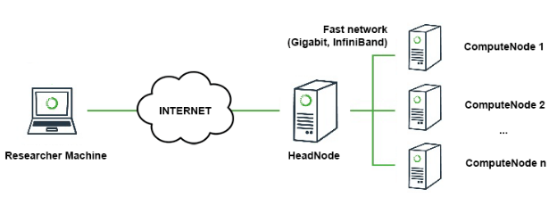

# FedML Distributed Computing Hardware and Software Configuration

## 1. Hardware Requirements


The computing architecture is comprised of
1. N compute nodes, each compute node is a multi-GPU server node (e.g., 8 x NVIDIA V100). 
2. A head node (login, testing) 
3. A centralized fault-tolerant file-server (e.g., NFS). In machine learning setting, this is used to share large-scale dataset among compute nodes.

Note: 1) Any FL topology can be ran in this physical configuration (e.g. decentralized FL); 2) High bandwidth configuration such as InfiniBand is optional.

### **- NFS (Network File System) Configuration**
Please google related installment instructions according to the OS version of your server.

### **- change SSH configuration for your cluster**

- On your local computer (MAC/Windows), generate the public key:
> mkdir ~/.ssh
> ls ~/.ssh
> ssh-keygen -t rsa
> vim ~/.ssh/id_rsa.pub

- Login to the server-side:
> ssh chaoyang@xxx.usc.edu

- modify the "authorized_keys"
> vim ~/.ssh/authorized_keys


Paste the string in "id_rsa.pub" file on your local computer to the server side "authorized_keys" file, and save the authorized_keys
> chmod 700 ~/.ssh/
> chmod 600 ~/.ssh/authorized_keys


- login out and login again, you will find you don't need to input the passwords anymore.

For other nodes on your server, use a similar method to configure the SSH.


## 2. Software Configuration

Code implementation is based on PyTorch >= 1.4.0, MPI4Py >= 3.0.3 (https://pypi.org/project/mpi4py), and Python >= 3.7.4.

The experiment tracking platform is supported by Weights and Bias: https://www.wandb.com/

Here is a step-by-step configuration to help you quickly set up a multi-GPU computing environment.
### **- Install Conda**

https://docs.conda.io/projects/conda/en/latest/user-guide/getting-started.html
https://docs.conda.io/projects/conda/en/latest/user-guide/cheatsheet.html

### **- PyTorch**

> conda install pytorch torchvision cudatoolkit=10.2 -c pytorch

### **- MPI4py**
> conda install -c anaconda mpi4py

### **- Weights and Bias**
> pip install --upgrade wandb

### **- config MPI host file**
Modify the hostname list in "mpi_host_file" to correspond to your actual physical network topology (in linux, use "hostname" command to get the hostname).
An example: Let us assume a network has a management node and four compute nodes (hostname: node1, node2, node3, node4).
If you want use node1 and node2 to run our program, the "mpi_host_file" should be:
> node1 \
> node2 \
> node3


### **- install other required packages**
> pip install -r requirements.txt


### **- Experimental Tracking Platform (report real-time result to wandb.com)**
wandb login ee0b5f53d949c84cee7decbe7a629e63fb2f8408

(please modify the ID to your own)

## 3. Run Experiments (ResNet)

### CIFAR10
train on IID dataset 
```
sh run_fedavg_distributed_pytorch.sh 1 8 resnet56 homo 100 20 64 0.001 cifar10 "./../../../data/cifar10"

##run on background
nohup sh run_fedavg_distributed_pytorch.sh 1 8 resnet56 homo 100 20 64 0.001 cifar10 "./../../../data/cifar10" > ./fedavg-resnet-homo-cifar10.txt 2>&1 &
```

train on non-IID dataset
```
sh run_fedavg_distributed_pytorch.sh 1 8 resnet56 hetero 100 20 64 0.001 cifar10 "./../../../data/cifar10"

##run on background
nohup sh run_fedavg_distributed_pytorch.sh 1 8 resnet56 hetero 100 20 64 0.001 cifar10 "./../../../data/cifar10" > ./fedavg-resnet-hetero-cifar10.txt 2>&1 &
```


### CIFAR100
train on IID dataset 
```
sh run_fedavg_distributed_pytorch.sh 1 8 resnet56 homo 100 20 64 0.001 cifar100 "./../../../data/cifar100"

##run on background
nohup sh run_fedavg_distributed_pytorch.sh 1 8 resnet56 homo 100 20 64 0.001 cifar100 "./../../../data/cifar100" > ./fedavg-resnet-homo-cifar100.txt 2>&1 &
```

train on non-IID dataset
```
sh run_fedavg_distributed_pytorch.sh 1 8 resnet56 hetero 100 20 64 0.001 cifar100 "./../../../data/cifar100"

##run on background
nohup sh run_fedavg_distributed_pytorch.sh 1 8 resnet56 hetero 100 20 64 0.001 cifar100 "./../../../data/cifar100" > ./fedavg-resnet-hetero-cifar100.txt 2>&1 &
```


### CINIC10
train on IID dataset 
```
sh run_fedavg_distributed_pytorch.sh 1 8 resnet56 homo 100 20 64 0.001 cinic10 "./../../../data/cinic10"

##run on background
nohup sh run_fedavg_distributed_pytorch.sh 1 8 resnet56 homo 100 20 64 0.001 cinic10 "./../../../data/cinic10" > ./fedavg-resnet-homo-cinic10.txt 2>&1 &
```

train on non-IID dataset
```
sh run_fedavg_distributed_pytorch.sh 1 8 resnet56 hetero 100 20 64 0.001 cinic10 "./../../../data/cinic10"

##run on background
nohup sh run_fedavg_distributed_pytorch.sh 1 8 resnet56 hetero 100 20 64 0.001 cinic10 "./../../../data/cinic10" > ./fedavg-resnet-hetero-cinic10.txt 2>&1 &
```


## 4. Run Experiments (MobileNet)

#### CIFAR10
train on IID dataset 
```
sh run_fedavg_distributed_pytorch.sh 1 8 mobilenet homo 100 20 64 0.001 cifar10 "./../../../data/cifar10"

##run on background
nohup sh run_fedavg_distributed_pytorch.sh 1 8 mobilenet homo 100 20 64 0.001 cifar10 "./../../../data/cifar10" > ./fedavg-mobilenet-homo-cifar10.txt 2>&1 &
```

train on non-IID dataset
```
sh run_fedavg_distributed_pytorch.sh 1 8 mobilenet hetero 100 20 64 0.001 cifar10 "./../../../data/cifar10"

##run on background
nohup sh run_fedavg_distributed_pytorch.sh 1 8 mobilenet hetero 100 20 64 0.001 cifar10 "./../../../data/cifar10" > ./fedavg-mobilenet-hetero-cifar10.txt 2>&1 &
```


#### CIFAR100
train on IID dataset 
```
sh run_fedavg_distributed_pytorch.sh 1 8 mobilenet homo 100 20 64 0.001 cifar100 "./../../../data/cifar100"

##run on background
nohup sh run_fedavg_distributed_pytorch.sh 1 8 mobilenet homo 100 20 64 0.001 cifar100 "./../../../data/cifar100" > ./fedavg-mobilenet-homo-cifar100.txt 2>&1 &
```

train on non-IID dataset
```
sh run_fedavg_distributed_pytorch.sh 1 8 mobilenet hetero 100 20 64 0.001 cifar100 "./../../../data/cifar100"

##run on background
nohup sh run_fedavg_distributed_pytorch.sh 1 8 mobilenet hetero 100 20 64 0.001 cifar100 "./../../../data/cifar100" > ./fedavg-mobilenet-hetero-cifar100.txt 2>&1 &
```


#### CINIC10
train on IID dataset 
```
sh run_fedavg_distributed_pytorch.sh 1 8 mobilenet homo 100 20 64 0.001 cinic10 "./../../../data/cinic10"

##run on background
nohup sh run_fedavg_distributed_pytorch.sh 1 8 mobilenet homo 100 20 64 0.001 cinic10 "./../../../data/cinic10" > ./fedavg-mobilenet-homo-cinic10.txt 2>&1 &
```

train on non-IID dataset
```
sh run_fedavg_distributed_pytorch.sh 1 8 mobilenet hetero 100 20 64 0.001 cinic10 "./../../../data/cinic10"

##run on background
nohup sh run_fedavg_distributed_pytorch.sh 1 8 mobilenet hetero 100 20 64 0.001 cinic10 "./../../../data/cinic10" > ./fedavg-mobilenet-hetero-cinic10.txt 2>&1 &
```


