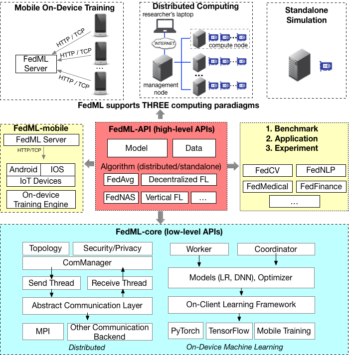

# System Architecture Overview

## System Design

## Code Structure
The functionality of each code package is as follows:

**fedml_core**: The FedML low level API package. This package implements distributed computing by communication backend like MPI, and also support topology management. 
Other low-level APIs related to security and privacy are also supported.

**fedml**: The FedML high level API package. This package support different federated learning algorithm with only one line code.
All algorithms are built based on the "fedml_core" package.
Users can change this package to add more advanced algorithms.

**fedml_mobile**: This package is used to support on-device training using Android/iOS smartphones. 

**fedml_experiments**: This package is used to test algorithms in "fedml" package by calling high level APIs.

**benchmark**: This package is used to run benchmark experiments.

**applications**: This package is a collection of applications based on FedML.

## FedML-Mobile Architecture Design
Stay turned!